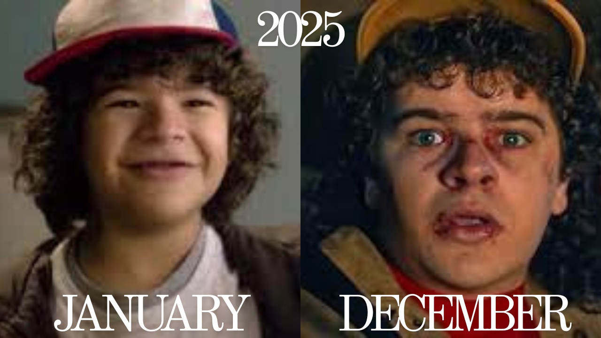

<h1 align = "center">We are IEEE-VIT. 🚀</h1>

  

  <b><i>IDEATE. INNOVATE. INSPIRE.</i></b>  

  IEEE VIT is a community comprising the most persevering of student developers, designers, and managers. Our ever-growing arsenal of projects covers a range of domains and technologies, from Web Development and App Development to Machine Learning and Electronics. 

  We 💙 open-source development. If you're here, chances are you do too! Contribute to our <a href="https://github.com/orgs/IEEE-VIT/repositories">projects</a>!  

---

  
    IEEE offers a range of exciting projects across diverse disciplines, ready for your innovative touch in 2025! 🥳

 
<b>🎄 December @ IEEE VIT slips in like Stranger Things, festive on the outside, upside-down levels of productivity inside. 🌌</b>

   
  🎁 This December, we don’t slow down, we level up. 🎁  
  ✨ Finish that feature lurking in your backlog like a Demogorgon in the dark, refactor that code haunting your repo since mid-sem, and ship something that deserves a spot on Santa’s “Epic Commits” list. ✨

   
   “Code is like the Upside Down, mysterious, unpredictable, and wildly fun.
   Stay brave, stay curious, and remember: even when things break… friends don’t let friends debug alone.” 🔦gt</code> 

  <a>⚔️</a>

  <a href="https://youtu.be/O5HQ1sZseKg?si=R86hSO4wfFsB5tRg&t=93" target="_blank">🎄</a>

