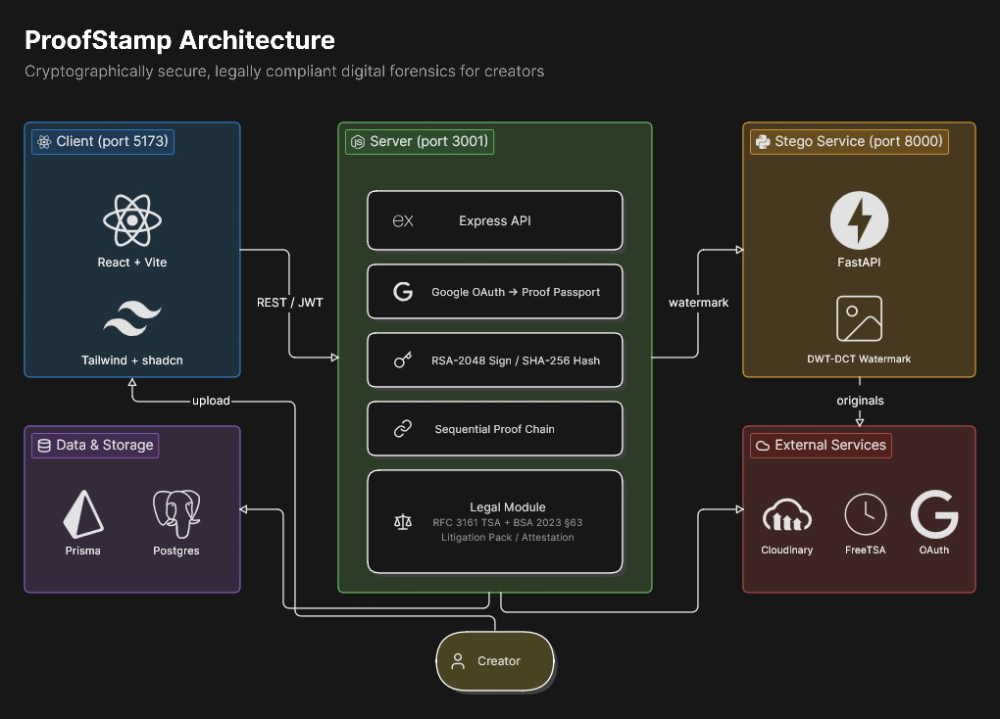

<h1 align = "center">We are IEEE-VIT. 🚀</h1>

  

  <b><i>IDEATE. INNOVATE. INSPIRE.</i></b>  

  IEEE VIT is a community comprising the most persevering of student developers, designers, and managers. Our ever growing arsenal of projects covers a range of domains and technologies, from Web Development and App Development to Machine Learning and Electronics.

  We 💙 open-source development. If you're here, chances are you do too! Contribute to our <a href="https://github.com/orgs/IEEE-VIT/repositories">projects</a>!  

---

  
    IEEE offers a range of exciting projects across diverse disciplines, ready for your innovative touch in 2026! 🥳

 

  <b>September @ IEEE VIT is about depth, discipline, and building things that matter.</b>

   
  Sharper execution, cleaner systems, and code that holds up under pressure. Less noise. More signal. Real ownership. 

   September is not about doing more. 
  This isn't a sprint month. It's an ownership month.  
  The kind where you stay on the bug past the point of curiosity, where the architecture gets questioned before it gets built, where "good enough" isn't in the vocabulary. Small, deliberate, relentless.

   
   "The best engineering does not announce itself. It just works.
   Built carefully. Tested honestly. Improved relentlessly.
   Solid foundations. Clear thinking. Shared accountability.
   Because when a team builds with discipline, the work speaks for itself."

  <a href="https://youtu.be/F-6OLCvO7MA?si=M3tgj-xOAYacya0e" target="_blank">🐞</a>

 <h2>September's Project of the Month</h2>

  <b>
    <a href="https://github.com/IEEE-VIT/FL_Powered_Medical_AI">ProofStamp</a>
  </b>

  

ProofStamp is a legal-tech platform that gives Indian content creators verifiable proof of ownership for their digital work. Creators can upload photographs, illustrations, documents, scripts, audio, video, and other digital files and receive a cryptographically secured Proof Passport. The platform combines identity binding, SHA-256 hashing, RSA signatures, trusted timestamps, invisible watermarking, blockchain anchoring, and digital evidence generation to establish the existence, integrity, and ownership context of a work while keeping the original content private.

 

## Features

- **Proof Passport & Identity:** Creates a unique Proof Passport linked to a verified creator identity and RSA-2048 keypair, allowing every registered work to be securely associated with its creator.

- **Cryptographic Proof & Timestamping:** Generates SHA-256 fingerprints and RSA signatures for uploaded files and adds RFC 3161 timestamps to establish the integrity and existence of the exact digital work.

- **Legal Evidence Generation:** Produces structured evidence and certificates aligned with the BSA 2023 Section 63 workflow, along with litigation-ready evidence packets and creator attestations.

- **Invisible Watermarking & Similarity Detection:** Uses DWT-DCT invisible watermarking and perceptual hashing to help identify protected content even when copies are resized, compressed, or modified.

- **Blockchain Anchoring & Audit Trail:** Anchors cryptographic proofs to the Bitcoin blockchain and maintains a traceable record of timestamps, verification events, and proof-chain information.

- **Content Monitoring & Enforcement:** Detects potential unauthorized copies of registered content and assists creators by compiling infringement evidence and generating takedown packages for review.

- **Multi-Format Protection:** Supports a wide range of creative work including images, illustrations, documents, scripts, audio, video, and other digital content.
 

<h2 align="center">

  

  

<b>Architecture Overview</b>

 

ProofStamp follows a modular microservice architecture where the React + Vite client provides the user interface and communicates with the Node.js + Express API layer. The API manages authentication, proof registration, verification workflows, database operations, and communication with external services. PostgreSQL stores users, assets, proof records, and verification data through Prisma, while the Python FastAPI steganography service handles computationally intensive operations such as image watermarking and forensic processing. Docker isolates the services and provides a consistent deployment environment. During registration, an uploaded file moves through hashing, identity signing, timestamping, optional watermarking, and proof-chain generation before the resulting evidence is stored and presented to the creator through the frontend.

