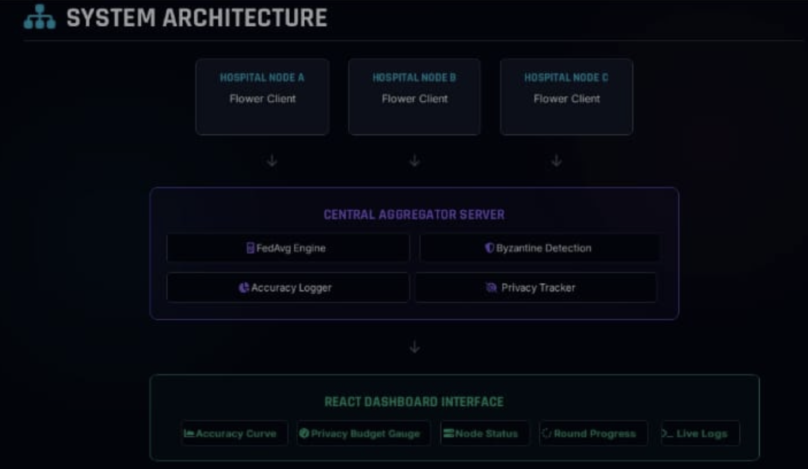

<h1 align = "center">We are IEEE-VIT. 🚀</h1>

  

  <b><i>IDEATE. INNOVATE. INSPIRE.</i></b>  

  IEEE VIT is a community comprising the most persevering of student developers, designers, and managers. Our ever growing arsenal of projects covers a range of domains and technologies, from Web Development and App Development to Machine Learning and Electronics.

  We 💙 open-source development. If you're here, chances are you do too! Contribute to our <a href="https://github.com/orgs/IEEE-VIT/repositories">projects</a>!  

---

  
    IEEE offers a range of exciting projects across diverse disciplines, ready for your innovative touch in 2026! 🥳

 

  <b>August @ IEEE VIT is about depth, discipline, and building things that matter.</b>

   
  Sharper execution, cleaner systems, and code that holds up under pressure. Less noise. More signal. Real ownership. 

   August is not about doing more. 
  This isn't a sprint month. It's an ownership month.  
  The kind where you stay on the bug past the point of curiosity, where the architecture gets questioned before it gets built, where "good enough" isn't in the vocabulary. Small, deliberate, relentless.

   
   "The best engineering does not announce itself. It just works.
   Built carefully. Tested honestly. Improved relentlessly.
   Solid foundations. Clear thinking. Shared accountability.
   Because when a team builds with discipline, the work speaks for itself."

  <a href="https://www.youtube.com/watch?v=ZhIsAZO5gl0" target="_blank">🐞</a>

 <h2>August's Project of the Month</h2>

  <b>
    <a href="https://github.com/IEEE-VIT/FL_Powered_Medical_AI">FLAIM</a>
  </b>

   
  FLAIM is a federated learning framework that lets multiple hospitals collaboratively train a chest X-ray diagnosis model without sharing patient data. Each hospital trains locally on its own dataset and shares only model updates. These updates are combined into a global model using Federated Averaging (FedAvg). Patient images never leave the hospital where they were collected.

  The core architectural decision is the split between local computation and global knowledge: each hospital node runs its own training pipeline and differential privacy module on premises, and only noised, clipped model weights are transmitted. Raw data stays siloed while the aggregator still produces a model trained on the collective signal from every node.
   
   

## Features

* **Federated Learning core:** A Flower based framework coordinates training across hospital nodes using the FedAvg aggregation strategy. Each node trains locally on its own partition of the PadChest dataset.
* **Differential Privacy:** Opacus handles per sample gradient clipping and noise injection before parameters are shared. Privacy budget (ε) is tracked and logged for every round.
* **DenseNet121 transfer learning:** An ImageNet pretrained DenseNet121 backbone is fine tuned on chest X-ray data, with `denseblock4`, `norm5`, and `classifier` layers unfrozen for training. This allows fast convergence even with limited per hospital data.
* **Byzantine detection support:** Aggregation level anomaly detection hooks flag suspicious model updates. This guards against poisoning attempts from compromised or malicious nodes.
* **Model checkpointing:** Global model state is checkpointed round wise. Training can be paused, audited, or resumed without loss of progress.
* **Dashboard and monitoring APIs:** A dedicated API layer exposes node status, training round progress, accuracy/loss history, privacy budget consumption, and system logs. This powers a central dashboard for the federation.
* **Multi-label disease classification:** The global model currently classifies Pulmonary Fibrosis, Scoliosis, and Emphysema. The framework is designed to extend to additional disease labels and nodes via config.
   

  
    
  <b>Architecture Overview</b>
 
End to end flow showing hospital nodes (Flower clients) training locally on their own data partitions, sending model updates to the central aggregator server for FedAvg aggregation, Byzantine detection, accuracy logging, and privacy tracking, with the resulting global model state surfaced through a React dashboard interface showing accuracy curves, privacy budget gauge, node status, round progress, and live logs.

